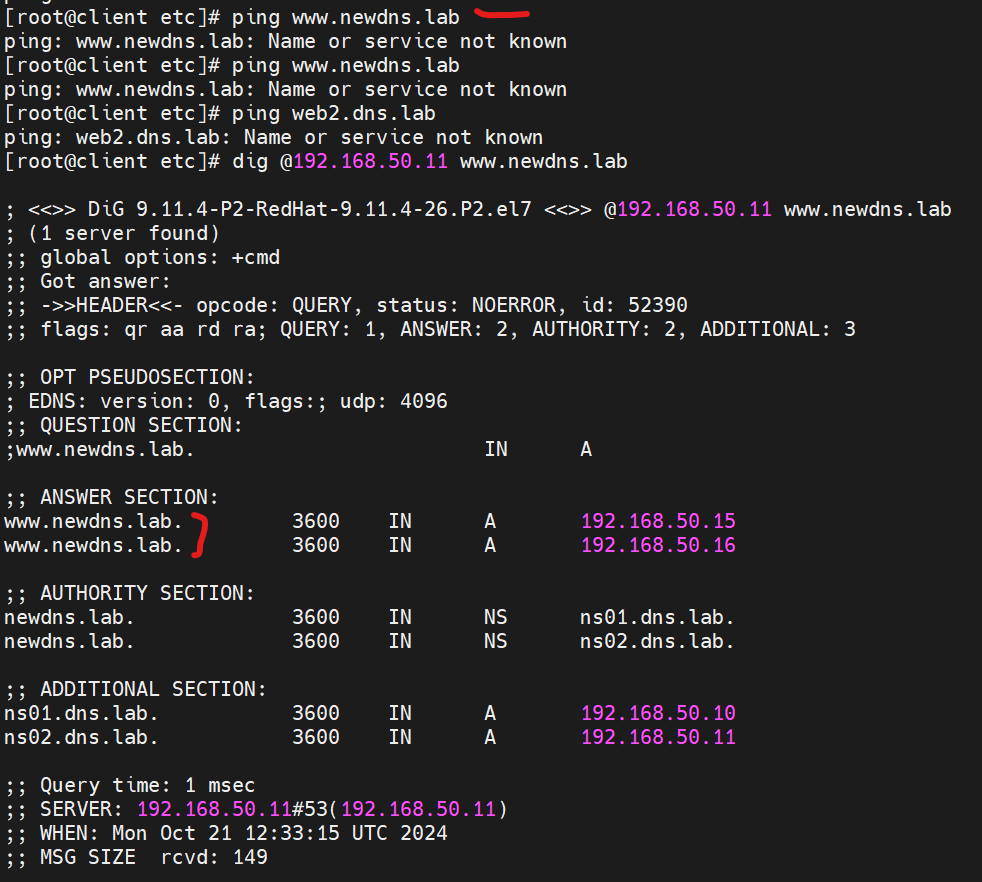

# homework-DNS

Описание домашнего задания
---
1. Взять стенд https://github.com/erlong15/vagrant-bind
2. добавить еще один сервер client2
3. завести в зоне dns.lab имена
web1 - смотрит на клиент1
web2  смотрит на клиент2
4. завести еще одну зону newdns.lab
5. завести в ней запись
www - смотрит на обоих клиентов
6. настроить split-dns
клиент1 - видит обе зоны, но в зоне dns.lab только web1
клиент2 видит только dns.lab


ОС для настройки: CentOS Linux release 7.9.2009 (Core)

Vagrant версии 2.4.1

VirtualBox версии 7.0.18

В силу недостаточности ресурсов ПК, развернуть стенд через Ansible-playbook не удалось, система вылетает. С одной стороны - очень обидно, потому что это было бы удобнее, с другой - зато "набил шишек", и сложилось большее понимание, где что лежит, какие конфиги, как их изменения меняют на систему.  

---
- Этап 1: Скачиваем Vagrantfine, редактируем, запускаем ВМ.

После того, как VM все таки развернулись, создадим\обновим файлы для приведения стенда к работе:

**На всех хостах:**
1. Меняем репозиторий, потому что из коробки не работает!
2. Менял на https://mirror.yandex.ru/centos/centos/7/os/x86_64/
3. обновляем пакеты, устанавливаем ПО: yum -y install nano bind bind-utils ntp


**Примечание** для всех больших файлов я не буду тут вставлять код, а загружу их в репозиторий 


**Создаем файл named.zonetransfer.key**

```bash
nano /etc/named.zonetransfer.key

key "zonetransfer.key" {
    algorithm hmac-md5;
    secret "SB4Db9pJomyKxTNynlAq/g==";
};
```


Меняем владельца и группу, меняем права доступа
```bash
chown root:named /etc/named.zonetransfer.key
chmod 0644 /etc/named.zonetransfer.key
```
---
**На ns01**

Создаем файл **named.conf**

```bash
nano /etc/named.conf

Меняем владельца и группу, меняем права доступа
chown root:named /etc/named.conf
chmod 0640 /etc/named.conf
```

---
Создаем файлы **named.ddns.lab**, **named.dns.lab**, **dns.lab.rev**

Для этих файлов:


```bash
chown root:named /etc/named/<file_name>
chmod 0660 /etc/named/<file_name>
```

---
Создаем файл **/etc/resolv.conf**

```bash
nano /etc/resolv.conf

Меняем владельца и группу, меняем права доступа
chown root:root /etc/resolv.conf
chmod 0644 /etc/resolv.conf
```

---
Меняем права каталога **/etc/named**
```bash
chown root:named /etc/named/
chmod 0670 /etc/named/
```

---
Перезагружаем сервис, добавляем в автозагрузку
```bash
systemctl restart named
systemctl enable named
```


---
**ТОПАЕМ на ns02**

---
Создаем файл **named.conf**

```bash
nano /etc/named.conf

Меняем владельца и группу, меняем права доступа
chown root:named /etc/named.conf
chmod 0640 /etc/named.conf
```

---
Создаем файл **/etc/resolv.conf**

```bash
nano /etc//etc/resolv.conf

Меняем владельца и группу, меняем права доступа
chown root:root /etc/resolv.conf
chmod 0644 /etc/resolv.conf
```

---
Меняем права каталога **/etc/named**
```bash
chown root:named /etc/named/
chmod 0670 /etc/named/
```

---
Перезагружаем сервис, добавляем в автозагрузку
```bash
systemctl restart named
systemctl enable named
```

---
**ТОПАЕМ на client** + client2, Там все одинаково


Изменяем файл **/etc/resolv.conf**

```bash
nano /etc//etc/resolv.conf

Меняем владельца и группу, меняем права доступа
chown root:root /etc/resolv.conf
chmod 0644 /etc/resolv.conf
```


---
Создаем файл **/home/vagrant/rndc.conf**

```bash
nano /home/vagrant/rndc.conf

Меняем владельца и группу, меняем права доступа
chown vagrant:vagrant /home/vagrant/rndc.conf
chmod 0644 /home/vagrant/rndc.conf
```


---
Настройка сообщения при входе на сервер


Создаем файл **/etc/motd**

```bash
nano /etc/motd

Меняем владельца и группу, меняем права доступа
chown root:root /etc/motd
chmod 0644 /etc/motd
```

**Важно**. Так как файл resolv.conf уже был создан системой, я его не пересоздавал, а дописал строки в конце. ЭТО БЫЛО ОШИБКОЙ. Потому что на последнем этапе ДЗ я 2 часа не мог понять, где пинги..крутил вертел named.conf на серверах. А оказалось, что клиентские хосты обращались к DNS, которые в файлах были первые по списку, не получали от них ничего, и все. Дальше у моих DNS серверов они уже не спрашивали настройки (странно конечно)
Как только я закомментировал строки, все заработало


---
- Этап 2: Настройка времени, проверка портов, корректировки.

Для нормальной работы DNS-серверов, на них должно быть настроено одинаковое время. Для того, чтобы на всех серверах было одинаковое время, нам потребуется настроить NTP

Служба chronyd уже предустановлена и работает, дополнитульной настройки не трубется 


---
нужно обратить внимание, на каком адресе и порту работают наши DNS-сервера

```bash
ss -tulpn
```


Исходя из данной информации, нам нужно подкорректировать файл /etc/resolv.conf для DNS-серверов: на хосте ns01 указать nameserver 192.168.50.10, а на хосте ns02 — 192.168.50.11  


---
- Этап 3: Добавление имён в зону dns.lab


На **ns01** редактируем /etc/named.conf

```bash
// Имя зоны
zone "dns.lab" {
    type master;
    // Тем, у кого есть ключ zonetransfer.key можно получать копию файла зоны 
    allow-transfer { key "zonetransfer.key"; };
    // Файл с настройками зоны
    file "/etc/named/named.dns.lab";
};
```

---
На **ns02** редактируем /etc/named.conf


```bash
// Имя зоны
zone "dns.lab" {
    type slave;
    // Адрес мастера, куда будет обращаться slave-сервер
    masters { 192.168.50.10; };
};
```

---
На **ns01** редактируем /etc/named/named.dns.lab Добавляем в конец строки

```bash
;Web
web1            IN      A       192.168.50.15
web2            IN      A       192.168.50.16
```


Изменить значение Serial (добавить +1 к числу 2711201407), изменение значения serial укажет slave-серверам на то, что были внесены изменения и что им надо обновить свои файлы с зонами.

---
Перезагружаем сервисы

```bash
systemctl restart named 
```

---
После внесения изменений, выполним проверку с клиента:

```bash
dig @192.168.50.10 web1.dns.lab
dig @192.168.50.10 web1.dns.lab
```


---
- Этап 3: Создание новой зоны и добавление в неё записей


Для того, чтобы прописать на DNS-серверах новую зону нам потребуется:


**На хосте ns01 добавить зону в файл /etc/named.conf**

```bash
// lab's newdns zone
zone "newdns.lab" {
    type master;
    allow-transfer { key "zonetransfer.key"; };
    allow-update { key "zonetransfer.key"; };
    file "/etc/named/named.newdns.lab";
};
```

---
**На хосте ns02 также добавить зону и указать с какого сервера запрашивать информацию об этой зоне (фрагмент файла /etc/named.conf)**

```bash
// lab's newdns zone
zone "newdns.lab" {
    type slave;
    masters { 192.168.50.10; };
    file "/etc/named/named.newdns.lab";
};
```


---
**На хосте ns01 создадим файл /etc/named/named.newdns.lab**

```bash
nano /etc/named/named.newdns.lab

$TTL 3600
$ORIGIN newdns.lab.
@               IN      SOA     ns01.dns.lab. root.dns.lab. (
                            2711201007 ; serial
                            3600       ; refresh (1 hour)
                            600        ; retry (10 minutes)
                            86400      ; expire (1 day)
                            600        ; minimum (10 minutes)
                        )

                IN      NS      ns01.dns.lab.
                IN      NS      ns02.dns.lab.

; DNS Servers
ns01            IN      A       192.168.50.10
ns02            IN      A       192.168.50.11

;WWW
www             IN      A       192.168.50.15
www             IN      A       192.168.50.16
```

+ укажем владельца и права


```bash
chown root:named /etc/named/named.newdns.lab
chmod 0660 /etc/named/named.newdns.lab
```


---
После внесения данных изменений, изменяем значение serial **(добавлем +1 к значению 2711201007)** и перезапускаем named

```bash
systemctl restart named
```

---
- Этап 4: Настройка Split-DNS

У нас уже есть прописанные зоны dns.lab и newdns.lab. Однако по заданию client1  должен видеть запись web1.dns.lab и не видеть запись web2.dns.lab. Client2 может видеть обе записи из домена dns.lab, но не должен видеть записи домена newdns.lab Осуществить данные настройки нам поможет технология Split-DNS.  


**Настроим Split-DNS**

---
**Создадим дополнительный файл зоны dns.lab, в котором будет прописана только одна запись**


```bash
$TTL 3600
$ORIGIN dns.lab.
@               IN      SOA     ns01.dns.lab. root.dns.lab. (
                            2711201407 ; serial
                            3600       ; refresh (1 hour)
                            600        ; retry (10 minutes)
                            86400      ; expire (1 day)
                            600        ; minimum (10 minutes)
                        )

                IN      NS      ns01.dns.lab.
                IN      NS      ns02.dns.lab.

; DNS Servers
ns01            IN      A       192.168.50.10
ns02            IN      A       192.168.50.11

;Web
web1            IN      A       192.168.50.15
```

+ укажем владельца и права


```bash
chown root:named /etc/named/named.newdns.lab
chmod 0660 /etc/named/named.newdns.lab
```

---
**На хостах ns01 и ns02** вносим изменения в файл /etc/named.conf


Прежде всего нужно сделать access листы для хостов client и client2. Сначала сгенерируем ключи для хостов client и client2, для этого на хосте ns01 запустим утилиту tsig-keygen (ключ может генериться 5 минут и более): 

```bash
tsig-keygen
два ключа надо, процесс реально долгий
```


После генерации, мы увидим ключ (secret) и алгоритм с помощью которого он был сгенерирован. Оба этих параметра нам потребуются в access листе. 
Если нам потребуется, использовать другой алгоритм, то мы можем его указать как аргумент к команде, например:  tsig-keygen -a hmac-md5


**После их генерации добавим блок с access листами в конец файла /etc/named.conf**


```bash
#Описание ключа для хоста client
key "client-key" {
    algorithm hmac-sha256;
    secret "IQg171Ht4mdGYcjjYKhI9gSc1fhoxzHZB+h2NMtyZWY=";
};
#Описание ключа для хоста client2
key "client2-key" {
    algorithm hmac-sha256;
    secret "m7r7SpZ9KBcA4kOl1JHQQnUiIlpQA1IJ9xkBHwdRAHc=";
};
#Описание access-листов
acl client { !key client2-key; key client-key; 192.168.50.15; };
acl client2 { !key client-key; key client2-key; 192.168.50.16; };
```


В данном блоке access листов мы выделяем 2 блока: 
client имеет адрес 192.168.50.15, использует client-key и не использует client2-key
client2 имеет адрес 192ю168.50.16, использует clinet2-key и не использует client-key


**Описание ключей и access листов будет одинаковое для master и slave сервера**


---
Далее нужно создать файл с настройками зоны dns.lab для client, для этого **на мастер сервере создаём файл /etc/named/named.dns.lab.client** и добавляем в него следующее содержимое


```bash
$TTL 3600
$ORIGIN dns.lab.
@               IN      SOA     ns01.dns.lab. root.dns.lab. (
                            2711201407 ; serial
                            3600       ; refresh (1 hour)
                            600        ; retry (10 minutes)
                            86400      ; expire (1 day)
                            600        ; minimum (10 minutes)
                        )

                IN      NS      ns01.dns.lab.
                IN      NS      ns02.dns.lab.

; DNS Servers
ns01            IN      A       192.168.50.10
ns02            IN      A       192.168.50.11

;Web
web1            IN      A       192.168.50.15
```


---
**Вносим правки в /etc/named.conf**
Сам файл подгружен в репозиторий. Единственное, что стоит отметить, в него добавлены ключи и acl листы. Выставлен тип сервера, зоны сгруппированы в  представления (view) 

---
Аналогично вносим изменения в файл /etc/named.conf **на сервере ns02**. Файл будет похож на файл, лежащий на ns01, только в настройках будет указание забирать информацию с сервера ns01:

**Такие** большие конфиги очень трудно высматривать глазами, легко ошибиться, поэтому есть механизм проверки синтаксиса

```bash
named-checkconf
```

**На минуточку**, эта команда не умеет говорить, что все ОК, поэтому вывод будет пустым. Если что-то не так, будет сообщение


После внесения данных изменений можно перезапустить (по очереди) службу named на серверах ns01 и ns02.

---
Далее, нужно будет проверить работу Split-DNS с хостов client и client2. Для проверки можно использовать утилиту ping:


**Проверка на  client**


```bash
ping www.newdns.lab
ping web1.dns.lab
ping web2.dns.lab
```


На хосте мы видим, что client видит обе зоны (dns.lab и newdns.lab), однако информацию о хосте web2.dns.lab он получить не может. 

---
**Проверка на client2**


```bash
ping www.newdns.lab
ping web1.dns.lab
ping web2.dns.lab
```


Тут мы понимаем, что client2 видит всю зону dns.lab и не видит зону newdns.lab
Для того, чтобы проверить что master и slave сервера отдают одинаковую информацию, в файле /etc/resolv.conf можно удалить на время nameserver 192.168.50.10 и попробовать выполнить все те же проверки. Результат должен быть идентичный. 


**Неудачные дубли с Джеки Чаном** :D

+ полезно для будущего траблшуттинга


---
так бывает, когда синтаксически файл /etc/named.conf корректный, но вот логика нарушена


---
А вот так бывает, когда в файле резолва на клиенте в начале стоят хосты, которые не настраивались (дэфолтные). Не пингуется по имени, а вот если по IP обратится напрямую, все отдает, причем нужные блин данные. Это было фиаско)




